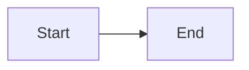

# n-aible EdTech Platform - Mintlify Documentation

This directory contains the Mintlify-powered documentation for the n-aible AI Agent Education Platform.

## 🌟 What is Mintlify?

[Mintlify](https://www.mintlify.com) is an AI-native documentation platform that provides:

- **Beautiful UI** out of the box with dark/light mode
- **AI-powered search** and assistance
- **MDX support** for interactive components
- **Git-based workflow** - changes auto-deploy
- **OpenAPI integration** for API docs
- **Mermaid diagrams** for visual documentation
- **MCP & LLMs.txt** support for AI discoverability

## 🚀 Quick Start

### Local Development

1. **Install Mintlify CLI**:
   ```bash
   npm i -g mintlify
   ```

2. **Start local preview**:
   ```bash
   cd mintlify-docs
   mintlify dev
   ```

3. **View documentation**:
   Open [http://localhost:3000](http://localhost:3000)

### Making Changes

1. Edit MDX files in this directory
2. Changes are reflected immediately in dev mode
3. Commit changes to git
4. Push to GitHub - Mintlify auto-deploys

## 📁 Directory Structure

```
mintlify-docs/
├── docs.json                    # Mintlify configuration
├── index.mdx                    # Homepage
├── quickstart.mdx              # Quick start guide
├── quick-reference.mdx         # Quick reference
│
├── setup/                      # Setup guides
│   ├── installation.mdx
│   ├── environment.mdx
│   ├── docker.mdx
│   └── google-oauth.mdx
│
├── architecture/               # Architecture documentation
│   ├── overview.mdx
│   ├── diagrams.mdx
│   ├── migration-guide.mdx
│   ├── update-summary.mdx
│   ├── backend/
│   │   ├── modular-structure.mdx
│   │   ├── modules.mdx
│   │   ├── common-infrastructure.mdx
│   │   └── database.mdx
│   └── frontend/
│       ├── nextjs.mdx
│       ├── components.mdx
│       └── state-management.mdx
│
├── features/                   # Feature documentation
│   ├── pdf-processing.mdx
│   ├── simulation-engine.mdx
│   ├── ai-personas.mdx
│   ├── cohort-management.mdx
│   ├── ai/
│   │   ├── openai-integration.mdx
│   │   ├── llamaparse.mdx
│   │   ├── persona-agents.mdx
│   │   └── grading-agents.mdx
│   └── workflows/
│       ├── professor.mdx
│       ├── student.mdx
│       └── simulation-flow.mdx
│
├── api/                        # API Reference
│   ├── auth/
│   │   ├── register.mdx
│   │   ├── login.mdx
│   │   ├── oauth.mdx
│   │   └── logout.mdx
│   ├── pdf/
│   │   ├── upload.mdx
│   │   ├── progress.mdx
│   │   └── websocket.mdx
│   ├── simulation/
│   │   ├── start.mdx
│   │   ├── chat.mdx
│   │   └── progress.mdx
│   ├── professor/
│   │   ├── cohorts.mdx
│   │   ├── invitations.mdx
│   │   └── grading.mdx
│   ├── student/
│   │   ├── simulations.mdx
│   │   ├── cohorts.mdx
│   │   └── progress.mdx
│   └── scenarios/
│       ├── list.mdx
│       ├── create.mdx
│       ├── update.mdx
│       └── delete.mdx
│
├── development/                # Development guides
│   ├── getting-started.mdx
│   ├── module-pattern.mdx
│   ├── testing.mdx
│   ├── deployment.mdx
│   ├── migration/
│   │   ├── overview.mdx
│   │   ├── modules.mdx
│   │   ├── database.mdx
│   │   └── services.mdx
│   └── best-practices/
│       ├── code-organization.mdx
│       ├── error-handling.mdx
│       ├── security.mdx
│       └── performance.mdx
│
├── logo/                       # Brand assets
│   ├── light.svg
│   └── dark.svg
│
├── images/                     # Documentation images
│   ├── hero-light.png
│   └── hero-dark.png
│
└── snippets/                   # Reusable content
    └── snippet-intro.mdx
```

## ✏️ Writing Documentation

### MDX Files

Mintlify uses MDX (Markdown + JSX), allowing you to:

- Write standard Markdown
- Use React components
- Add interactive elements
- Include Mermaid diagrams

Example:

```mdx
---
title: 'My Page'
description: 'Page description'
icon: 'rocket'
---

## Heading

Standard markdown content.

<Card title="Card Title" icon="star">
  Interactive card component
</Card>

<CodeGroup>
  ```python Python
  print("Hello World")
  ```
  
  ```javascript JavaScript
  console.log("Hello World")
  ```
</CodeGroup>


```

### Available Components

Mintlify provides many built-in components:

- `<Card>` - Interactive cards
- `<CardGroup>` - Grid of cards
- `<Accordion>` - Collapsible content
- `<AccordionGroup>` - Multiple accordions
- `<Tabs>` - Tabbed content
- `<Steps>` - Step-by-step guides
- `<CodeGroup>` - Multi-language code blocks
- `<Warning>` - Warning callout
- `<Check>` - Success callout
- `<Info>` - Info callout
- `<Tip>` - Tip callout

See [Mintlify Components](https://mintlify.com/docs/components) for more.

## 🎨 Customization

### Colors

Edit `docs.json`:

```json
{
  "colors": {
    "primary": "#3B82F6",
    "light": "#60A5FA",
    "dark": "#2563EB",
    "background": {
      "dark": "#0F172A",
      "light": "#FFFFFF"
    }
  }
}
```

### Navigation

Edit `docs.json` navigation structure:

```json
{
  "navigation": {
    "tabs": [
      {
        "tab": "Tab Name",
        "groups": [
          {
            "group": "Group Name",
            "pages": [
              "path/to/page"
            ]
          }
        ]
      }
    ]
  }
}
```

### Branding

Replace files in `logo/` directory:
- `logo/light.svg` - Light mode logo
- `logo/dark.svg` - Dark mode logo
- `favicon.svg` - Browser favicon

## 🚀 Deployment

### Automatic Deployment

1. **Connect GitHub**: Link your repository in [Mintlify Dashboard](https://dashboard.mintlify.com)
2. **Automatic Builds**: Every push to main triggers a build
3. **Preview Deployments**: PRs get preview URLs
4. **Custom Domain**: Configure in Mintlify Dashboard

### Manual Deployment

```bash
# Build for production
mintlify build

# Deploy
mintlify deploy
```

## 🔍 AI Features

Mintlify supports modern AI integration:

### LLMs.txt

Mintlify automatically generates `llms.txt` for AI discoverability. Your docs will show up in:
- ChatGPT
- Claude
- Perplexity
- Cursor
- Other AI tools

### MCP (Model Context Protocol)

Mintlify supports MCP for advanced AI interactions. Configure in `docs.json`:

```json
{
  "contextual": {
    "options": [
      "copy",
      "view",
      "chatgpt",
      "claude",
      "perplexity",
      "mcp",
      "cursor",
      "vscode"
    ]
  }
}
```

### AI Assistant

Enable the built-in AI assistant for your users:

```json
{
  "ai": {
    "enabled": true,
    "model": "gpt-4"
  }
}
```

## 📊 Analytics

Add analytics in `docs.json`:

```json
{
  "analytics": {
    "ga4": {
      "measurementId": "G-XXXXXXXXXX"
    },
    "mixpanel": {
      "projectToken": "your-project-token"
    }
  }
}
```

## 🔗 OpenAPI Integration

Mintlify can auto-generate API docs from OpenAPI specs:

1. Add OpenAPI spec to `api-reference/openapi.json`
2. Reference in `docs.json`:

```json
{
  "openapi": "api-reference/openapi.json"
}
```

For our FastAPI backend, export the OpenAPI spec:

```python
# In FastAPI app
import json

# Get OpenAPI schema
openapi_schema = app.openapi()

# Save to file
with open('openapi.json', 'w') as f:
    json.dump(openapi_schema, f, indent=2)
```

## 🧪 Testing

### Broken Links

```bash
mintlify check
```

### Local Preview

```bash
mintlify dev
```

### Build Test

```bash
mintlify build
```

## 📝 Best Practices

1. **Use MDX components** for rich, interactive content
2. **Add Mermaid diagrams** for visual explanations
3. **Include code examples** with syntax highlighting
4. **Use callouts** (Warning, Info, Tip) appropriately
5. **Keep navigation shallow** (max 3 levels)
6. **Use descriptive titles** and descriptions
7. **Add icons** to pages for visual navigation
8. **Include examples** for every API endpoint
9. **Update regularly** - docs should match code

## 🔗 Resources

- [Mintlify Documentation](https://mintlify.com/docs)
- [Mintlify Components](https://mintlify.com/docs/components)
- [MDX Documentation](https://mdxjs.com/)
- [Mermaid Documentation](https://mermaid.js.org/)

## 🆘 Troubleshooting

### Dev server not running

```bash
# Update Mintlify CLI
npm i -g mintlify@latest

# Clear cache
mintlify dev --clear-cache
```

### Page not showing

1. Check file is in correct directory
2. Verify path in `docs.json` navigation
3. Ensure `.mdx` extension
4. Check frontmatter is valid

### Build errors

```bash
# Check for broken links
mintlify check

# Validate docs.json
cat docs.json | json_pp
```

## 💡 Tips

- **Hot reload**: Changes appear instantly in dev mode
- **Search**: Mintlify provides instant search automatically
- **Versioning**: Use branches for version control
- **Feedback**: Enable user feedback in `docs.json`
- **SEO**: Mintlify handles SEO optimization automatically

## 📞 Support

- [Mintlify Slack](https://mintlify.com/community)
- [GitHub Discussions](https://github.com/yourusername/n-aible/discussions)
- [Email Support](mailto:hi@mintlify.com)

---

**Ready to write amazing documentation?** Start with `mintlify dev` and explore the power of AI-native documentation!
