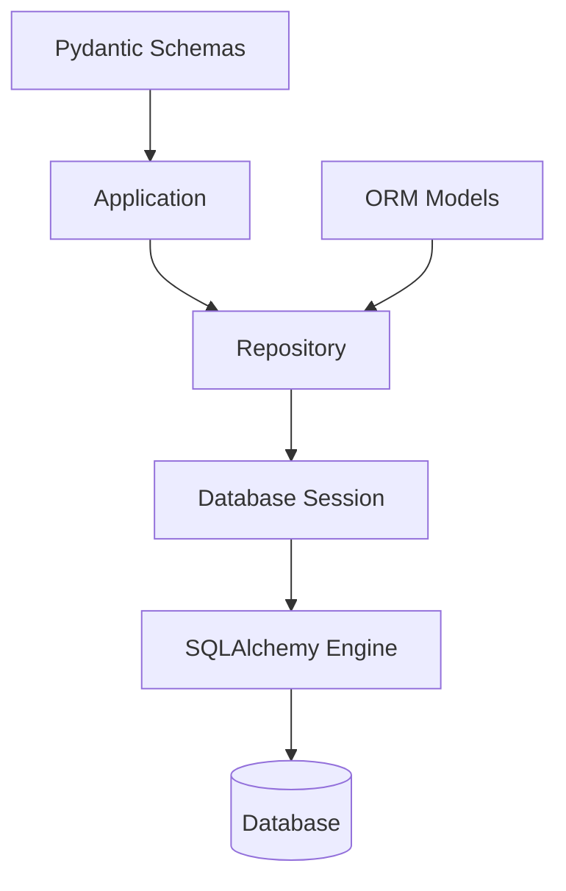

The database layer provides a clean abstraction for data access using SQLAlchemy ORM with a repository pattern.

## Architecture



## Database Configuration

### Development

- **Database**: SQLite (default)
- **Location**: `app.db` in backend directory
- **Auto-creation**: Tables created automatically on startup

### Production

- **Database**: PostgreSQL
- **Connection**: Configured via `DATABASE_URL` environment variable
- **Migrations**: Alembic for schema changes

## Database Layer Structure

```
common/db/
├── base.py        # SQLAlchemy Base class
├── core.py        # Engine, sessions, get_db()
└── mixins.py      # Reusable model columns
```

## Core Components

### Base Class (`common/db/base.py`)

```python
from sqlalchemy.orm import DeclarativeBase

class Base(DeclarativeBase):
    pass
```

All ORM models inherit from this base class.

### Engine and Sessions (`common/db/core.py`)

```python
from sqlalchemy import create_engine
from sqlalchemy.orm import sessionmaker
from common.config import get_settings

settings = get_settings()
engine = create_engine(settings.database_url, future=True, echo=False)
SessionLocal = sessionmaker(bind=engine, autoflush=False, autocommit=False, future=True)

def get_db() -> Iterator:
    """FastAPI dependency that yields a database session."""
    db = SessionLocal()
    try:
        yield db
    finally:
        db.close()
```

**Features:**
- Connection pooling
- Automatic session cleanup
- FastAPI dependency integration

### Mixins (`common/db/mixins.py`)

Reusable model columns:

```python
from sqlalchemy import Column, DateTime, Boolean
from datetime import datetime

class TimestampMixin:
    created_at = Column(DateTime, default=datetime.utcnow, nullable=False)
    updated_at = Column(DateTime, default=datetime.utcnow, onupdate=datetime.utcnow)

class SoftDeleteMixin:
    is_deleted = Column(Boolean, default=False, nullable=False)
    deleted_at = Column(DateTime, nullable=True)
```

## Repository Pattern

Each module uses a repository for data access:

```python
# modules/auth/repository.py
from sqlalchemy.orm import Session
from modules.auth import models

class UserRepository:
    def __init__(self, db: Session):
        self.db = db
    
    def get_by_email(self, email: str):
        return self.db.query(models.User).filter(models.User.email == email).first()
    
    def create(self, **kwargs):
        user = models.User(**kwargs)
        self.db.add(user)
        self.db.commit()
        self.db.refresh(user)
        return user
```

**Benefits:**
- Abstracts database queries
- Easy to test (mock repository)
- Clear data access boundaries

## ORM Models

Models are defined in module-specific files:

```python
# modules/auth/models.py
from sqlalchemy import Column, Integer, String, Boolean, DateTime
from common.db.base import Base
from datetime import datetime

class User(Base):
    __tablename__ = "users"
    
    id = Column(Integer, primary_key=True, index=True)
    email = Column(String(255), unique=True, nullable=False, index=True)
    password_hash = Column(String(255), nullable=False)
    full_name = Column(String(255), nullable=True)
    is_active = Column(Boolean, default=True)
    created_at = Column(DateTime, default=datetime.utcnow, nullable=False)
```

## Using the Database

### In Routers

```python
from fastapi import Depends
from sqlalchemy.orm import Session
from common.db.core import get_db
from modules.auth.repository import UserRepository
from modules.auth.service import AuthService

def get_service(db: Session = Depends(get_db)) -> AuthService:
    return AuthService(UserRepository(db))

@router.post("/register")
def register_user(payload: UserCreate, service: AuthService = Depends(get_service)):
    user = service.register(payload)
    return user
```

### In Services

```python
class AuthService:
    def __init__(self, repository: UserRepository):
        self.repository = repository
    
    def register(self, payload: UserCreate):
        if self.repository.get_by_email(payload.email):
            raise HTTPException(status_code=400, detail="Email already registered")
        # ... rest of logic
```

## Database Initialization

Tables are created automatically on application startup:

```python
# app/main.py
@asynccontextmanager
async def lifespan(app: FastAPI):
    """Application lifespan: startup and shutdown events."""
    # Startup
    Base.metadata.create_all(bind=engine)
    yield
    # Shutdown
```

<Info>
In production, use Alembic migrations instead of `create_all()` for better version control.
</Info>

## Best Practices

<CardGroup cols={2}>
  <Card title="Use Repositories">
    Never access database directly in services - use repositories
  </Card>
  <Card title="Transaction Management">
    Let SQLAlchemy handle transactions - commit in repository
  </Card>
  <Card title="Query Optimization">
    Use eager loading to avoid N+1 queries
  </Card>
  <Card title="Index Important Fields">
    Add indexes for frequently queried columns
  </Card>
</CardGroup>

## Testing

Test database uses SQLite with isolated sessions:

```python
# tests/conftest.py
TEST_DATABASE_URL = "sqlite:///./test.db"

@pytest.fixture(scope="function")
def db_session():
    """Create a fresh database session for each test."""
    Base.metadata.create_all(bind=engine)
    db = TestSessionLocal()
    try:
        yield db
    finally:
        db.close()
        Base.metadata.drop_all(bind=engine)
```

<Info>
Each test gets a clean database state, ensuring tests don't interfere with each other.
</Info>

## Next Steps

<CardGroup cols={2}>
  <Card title="Module Pattern" icon="puzzle-piece" href="/architecture/backend/modules">
    See how modules use repositories
  </Card>
  <Card title="Development Guide" icon="book" href="/development/getting-started">
    Learn to implement repositories
  </Card>
  <Card title="Testing Guide" icon="flask" href="/development/testing">
    Test database interactions
  </Card>
</CardGroup>


