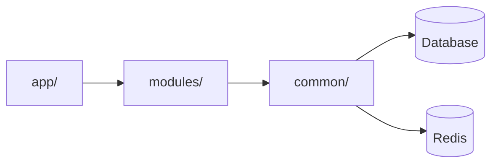

The backend is organized into **feature modules** that own their business logic, data access, and API endpoints. This structure makes it easy to understand, test, and extend the system.

## Structure Overview

```
backend/
├── app/                    # FastAPI application framework
│   ├── main.py            # Application entrypoint
│   ├── api/               # Router registration
│   │   └── __init__.py    # Includes all module routers
│   ├── dependencies.py    # Dependency injection
│   ├── middleware.py      # CORS, auth, error handling
│   └── lifespan.py        # Startup/shutdown hooks
│
├── common/                # Shared infrastructure
│   ├── config.py          # Pydantic settings
│   ├── db/                # Database layer
│   ├── security/          # Auth utilities
│   ├── services/          # Cross-cutting services
│   └── utils/             # Helper utilities
│
└── modules/               # Feature modules
    ├── auth/              # ✅ Complete example
    ├── simulation/        # Placeholder
    ├── pdf_processing/    # Placeholder
    └── ...
```

## Application Layer (`app/`)

The application layer is the **wiring** that connects everything together.

### `app/main.py`

Application entrypoint that starts the FastAPI server:

```python
from fastapi import FastAPI
from app.api import router as api_router
from common.db.core import Base, engine

@asynccontextmanager
async def lifespan(app: FastAPI):
    """Application lifespan: startup and shutdown events."""
    Base.metadata.create_all(bind=engine)
    yield

app = FastAPI(title="Develop V2 Backend", version="0.1.0", lifespan=lifespan)
app.include_router(api_router)
```

**Responsibilities:**
- Creates FastAPI app instance
- Registers all routers
- Sets up lifespan handlers
- Defines health check endpoints

### `app/api/__init__.py`

Thin router registration layer that imports and includes module routers:

```python
from fastapi import APIRouter
from modules.auth.router import router as auth_router

router = APIRouter()
router.include_router(auth_router, prefix="/api/auth", tags=["Auth"])
```

**Responsibilities:**
- Import routers from `modules/*/router.py`
- Include them with appropriate prefixes and tags
- Centralized route registration

### `app/dependencies.py`

FastAPI dependency injection functions:

- `get_db()` - Database session provider
- `get_current_user()` - JWT authentication dependency
- `require_admin()` - Role-based access control

### `app/middleware.py`

HTTP middleware for request/response processing:

- CORS configuration
- Request logging
- Error handling (global exception handler)
- Rate limiting

### `app/lifespan.py`

Application lifecycle hooks:

- **Startup**: Initialize DB, load AI models, start background tasks
- **Shutdown**: Cleanup connections, save state

## Common Infrastructure (`common/`)

Shared code used across multiple features.

### `common/config.py`

Centralized configuration management using Pydantic Settings:

```python
from pydantic_settings import BaseSettings, SettingsConfigDict

class Settings(BaseSettings):
    model_config = SettingsConfigDict(env_file=".env", extra="ignore")
    
    database_url: str = "sqlite:///./app.db"
    secret_key: str = "super-secret-key"
    access_token_exp_minutes: int = 30
```

### `common/db/`

Database layer with SQLAlchemy:

- `base.py` - SQLAlchemy Base class
- `core.py` - Engine, session factory, `get_db()` dependency
- `mixins.py` - Reusable model columns (timestamps, soft delete)

### `common/security/`

Authentication and security utilities:

- `passwords.py` - Password hashing/verification (bcrypt)
- `tokens.py` - JWT token generation/validation

### `common/services/`

Cross-cutting services:

- `email_service.py` - Email sending
- `cache_service.py` - Unified caching (Redis + fallback)
- `ai_gateway.py` - Unified AI service interface

### `common/utils/`

Helper utilities:

- `auth.py` - Auth helpers
- `id_generator.py` - ID generation
- `security.py` - Security helpers

## Module Structure

Each module follows a consistent pattern:

```
modules/<feature>/
├── router.py          # FastAPI endpoints (HTTP layer)
├── service.py         # Business logic
├── repository.py      # Data access
├── schemas/           # Pydantic models
│   ├── dto.py         # Request/response DTOs
│   └── models.py      # Domain models
├── models.py          # SQLAlchemy ORM models (if needed)
└── tasks.py           # Background tasks (optional)
```

### Module Responsibilities

<CardGroup cols={2}>
  <Card title="Router">
    Thin HTTP layer: validates requests, calls services, returns responses
  </Card>
  <Card title="Service">
    Business logic: orchestration, validation, transformation
  </Card>
  <Card title="Repository">
    Data access: database queries, transactions
  </Card>
  <Card title="Schemas">
    Data validation: Pydantic models for requests/responses
  </Card>
</CardGroup>

## Dependency Flow



**Key Principle**: Dependencies flow in one direction:
- `app/` imports from `modules/`
- `modules/` import from `common/`
- `common/` has no dependencies on `modules/` or `app/`
- No circular imports possible

## Example: Auth Module

The auth module serves as a complete reference implementation:

```python
# modules/auth/router.py
@router.post("/register", response_model=UserRead)
def register_user(payload: UserCreate, service: AuthService = Depends(get_service)):
    user = service.register(payload)
    return user

# modules/auth/service.py
def register(self, payload: UserCreate):
    if self.repository.get_by_email(payload.email):
        raise HTTPException(status_code=400, detail="Email already registered")
    password_hash = hash_password(payload.password)
    return self.repository.create(email=payload.email, password_hash=password_hash)

# modules/auth/repository.py
def get_by_email(self, email: str):
    return self.db.query(models.User).filter(models.User.email == email).first()
```

## Benefits

<AccordionGroup>
  <Accordion title="Clear Ownership">
    Each module owns its domain - router, service, repository, and schemas all live together
  </Accordion>
  
  <Accordion title="Easy to Find Code">
    Need to change simulation logic? It's all in `modules/simulation/`
  </Accordion>
  
  <Accordion title="Independent Testing">
    Test each module in isolation with clear boundaries
  </Accordion>
  
  <Accordion title="Scalable">
    Add new features by creating new modules - no need to modify existing code
  </Accordion>
</AccordionGroup>

## Next Steps

<CardGroup cols={2}>
  <Card title="Module Details" icon="puzzle-piece" href="/architecture/backend/modules">
    Learn about individual modules
  </Card>
  <Card title="Common Infrastructure" icon="layer-group" href="/architecture/backend/common-infrastructure">
    Explore shared components
  </Card>
  <Card title="Development Guide" icon="book" href="/development/getting-started">
    Start implementing modules
  </Card>
  <Card title="Database Layer" icon="database" href="/architecture/backend/database">
    Understand database structure
  </Card>
</CardGroup>


