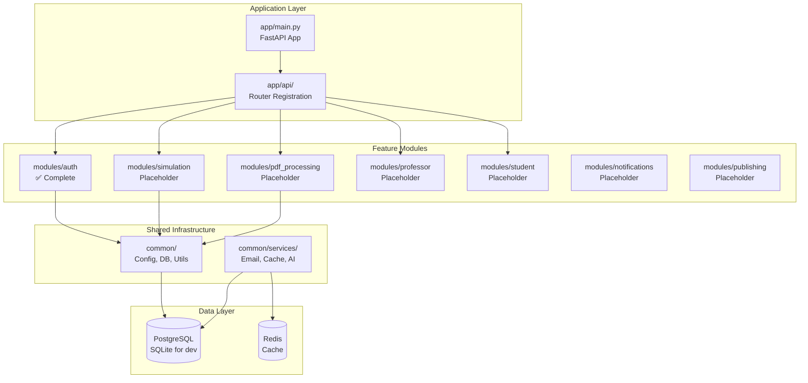

The n-aible backend follows a **modular, feature-based architecture** that emphasizes pragmatic organization, clear boundaries, and incremental development.

## Design Philosophy

<CardGroup cols={2}>
  <Card title="Feature-Based Organization">
    Code grouped by business capability (simulation, PDF processing, auth) rather than technical layer
  </Card>
  <Card title="Minimal Indirection">
    Fewer layers mean faster development and easier debugging
  </Card>
  <Card title="Shared Infrastructure">
    Common concerns (DB, config, logging) live in one place
  </Card>
  <Card title="Incremental Migration">
    Structure allows gradual refactoring from legacy codebase
  </Card>
</CardGroup>

## High-Level Architecture



## Key Principles

<Steps>
  <Step title="Routers are Thin">
    Validate requests, call services, return responses. No business logic.
  </Step>
  <Step title="Services Contain Logic">
    Business rules, orchestration, and validation belong in services.
  </Step>
  <Step title="Repositories Handle Data">
    Database queries only. No business logic in repositories.
  </Step>
  <Step title="Common Code is Shared">
    Infrastructure lives in `common/` and is used by all modules.
  </Step>
  <Step title="Modules are Independent">
    Each feature is self-contained with clear boundaries.
  </Step>
</Steps>

## Directory Structure

```
backend/
├── app/                    # FastAPI application framework
│   ├── main.py            # Application entrypoint
│   ├── api/               # Router registration
│   ├── dependencies.py    # Dependency injection
│   ├── middleware.py      # CORS, auth, error handling
│   └── lifespan.py        # Startup/shutdown hooks
│
├── common/                # Shared infrastructure
│   ├── config.py          # Pydantic settings
│   ├── db/                # Database layer
│   ├── security/          # Auth utilities
│   ├── services/          # Cross-cutting services
│   └── utils/             # Helper utilities
│
├── modules/               # Feature modules
│   ├── auth/             # ✅ Complete example
│   ├── simulation/       # Placeholder
│   ├── pdf_processing/   # Placeholder
│   ├── professor/        # Placeholder
│   ├── student/          # Placeholder
│   ├── notifications/    # Placeholder
│   └── publishing/       # Placeholder
│
└── tests/                # Test suite
    ├── conftest.py       # Test fixtures
    └── modules/          # Module tests
```

## Data Flow Example

### Starting a Simulation

```
1. HTTP Request → app/api/__init__.py (router registration)
   ↓
2. Routes to → modules/simulation/router.py (endpoints)
   ↓
3. Router validates → modules/simulation/schemas.py
   ↓
4. Router calls → modules/simulation/service.py
   ↓
5. Service queries → modules/simulation/repository.py
   ↓
6. Repository uses → common/db/core.py (DB session)
   ↓
7. Service orchestrates → modules/simulation/agents/
   ↓
8. Agent uses → common/services/ai_gateway.py
   ↓
9. Response flows back → Router → HTTP Response
```

## Benefits

<AccordionGroup>
  <Accordion title="Easier Navigation">
    Find all simulation code in `modules/simulation/` - no hunting across layers
  </Accordion>
  
  <Accordion title="Faster Development">
    Less indirection, clearer dependencies, easier to understand
  </Accordion>
  
  <Accordion title="Better Testing">
    Each module can be tested in isolation with clear boundaries
  </Accordion>
  
  <Accordion title="Incremental Migration">
    Can migrate one feature at a time without breaking everything
  </Accordion>
  
  <Accordion title="Clear Boundaries">
    Each module owns its domain - no confusion about where code belongs
  </Accordion>
  
  <Accordion title="Scalable">
    Easy to add new features - just create a new module
  </Accordion>
</AccordionGroup>

## Current Status

<CardGroup cols={3}>
  <Card title="Auth Module" icon="check">
    ✅ Fully implemented with tests
  </Card>
  <Card title="Other Modules" icon="code">
    Placeholder structure ready for implementation
  </Card>
  <Card title="Common Infrastructure" icon="sitemap">
    ✅ Config, DB, Security utilities ready
  </Card>
</CardGroup>

## Next Steps

<CardGroup cols={2}>
  <Card title="Backend Structure" icon="sitemap" href="/architecture/backend/modular-structure">
    Learn about the modular structure
  </Card>
  <Card title="Module Pattern" icon="puzzle-piece" href="/architecture/backend/modules">
    Understand module organization
  </Card>
  <Card title="Common Infrastructure" icon="layer-group" href="/architecture/backend/common-infrastructure">
    Explore shared components
  </Card>
  <Card title="Development Guide" icon="book" href="/development/getting-started">
    Start implementing modules
  </Card>
</CardGroup>


