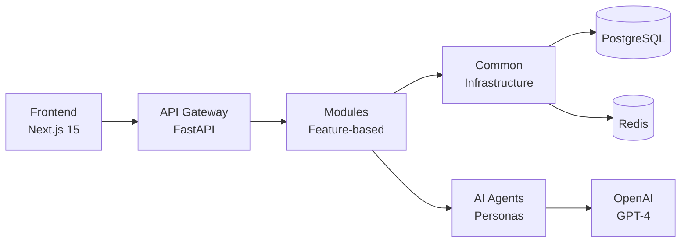

## Welcome to n-aible

The **AI Agent Education Platform** transforms business case studies into immersive AI-powered simulations using a modular, feature-based architecture.

<CardGroup cols={2}>
  <Card
    title="Quick Start"
    icon="rocket"
    href="/quickstart"
  >
    Get your local development environment running in 5 minutes
  </Card>
  <Card
    title="Architecture"
    icon="sitemap"
    href="/architecture/overview"
  >
    Explore our modular, feature-based backend architecture
  </Card>
  <Card
    title="API Reference"
    icon="code"
    href="/api/auth/register"
  >
    Complete API documentation for all endpoints
  </Card>
  <Card
    title="Developer Guide"
    icon="book"
    href="/development/getting-started"
  >
    Learn development patterns and best practices
  </Card>
</CardGroup>

## Platform Overview

<AccordionGroup>
  <Accordion title="PDF-to-Simulation Pipeline">
    Upload business case studies and let AI automatically extract scenarios, personas, and learning objectives. Uses **LlamaParse** for PDF processing and **OpenAI GPT-4** for content extraction.
    
    - Intelligent PDF processing
    - AI persona generation
    - Automatic scene creation
    - DALL-E 3 image generation
  </Accordion>

  <Accordion title="AI-Powered Simulations">
    Students engage in structured, multi-scene learning experiences with dynamic AI personas.
    
    - Linear scene progression
    - AI persona interactions
    - Real-time feedback
    - Progress tracking
  </Accordion>

  <Accordion title="Cohort Management">
    Professors can create learning groups, invite students, and track progress.
    
    - Create and manage cohorts
    - Student invitation system
    - Progress analytics
    - Grading interface
  </Accordion>

  <Accordion title="Modular Architecture">
    Feature-based backend structure with clear separation of concerns.
    
    - Repository pattern
    - Service layer
    - One-way dependencies
    - Redis caching
  </Accordion>
</AccordionGroup>

## Core Technologies

<CardGroup cols={3}>
  <Card title="FastAPI" icon="bolt">
    High-performance async Python web framework
  </Card>
  <Card title="Next.js 15" icon="react">
    React framework with App Router
  </Card>
  <Card title="PostgreSQL" icon="database">
    Primary database with JSONB support
  </Card>
  <Card title="OpenAI GPT-4" icon="brain">
    AI language model for personas
  </Card>
  <Card title="Redis" icon="gauge-high">
    Caching and session management
  </Card>
  <Card title="Docker" icon="docker">
    Containerized development
  </Card>
</CardGroup>

## Key Features

<Steps>
  <Step title="Upload PDF">
    Upload business case studies (Harvard Business Review, custom cases)
  </Step>
  <Step title="AI Extraction">
    AI automatically extracts scenarios, personas, and learning objectives
  </Step>
  <Step title="Create Simulation">
    Review and customize generated content, create scenes
  </Step>
  <Step title="Launch">
    Students engage in structured simulations with AI personas
  </Step>
  <Step title="Track Progress">
    Monitor student progress, provide feedback, and grade performance
  </Step>
</Steps>

## Quick Links

<CardGroup cols={2}>
  <Card title="Live API Docs" icon="server" href="http://localhost:8000/docs">
    Interactive FastAPI documentation (when running locally)
  </Card>
  <Card title="Frontend" icon="window" href="http://localhost:3000">
    Next.js application (when running locally)
  </Card>
  <Card title="GitHub" icon="github" href="https://github.com/yourusername/n-aible">
    Source code and issue tracking
  </Card>
  <Card title="Community" icon="users" href="https://github.com/yourusername/n-aible/discussions">
    Join discussions and get help
  </Card>
</CardGroup>

## Architecture Highlights

<Info>
  **Modular Design**: Our architecture follows a feature-based structure where each module owns its router, service, repository, and schemas.
</Info>

## Next Steps

<CardGroup cols={2}>
  <Card title="Set Up Locally" icon="terminal" href="/quickstart">
    Follow our 5-minute quick start guide
  </Card>
  <Card title="Explore Architecture" icon="diagram-project" href="/architecture/diagrams">
    Visual diagrams with sequence flows
  </Card>
  <Card title="API Reference" icon="code" href="/api/auth/register">
    Complete endpoint documentation
  </Card>
  <Card title="Development Guide" icon="hammer" href="/development/module-pattern">
    Learn our development patterns
  </Card>
</CardGroup>

<Check>
  Ready to transform business education with AI-powered simulations? Let's get started!
</Check>
